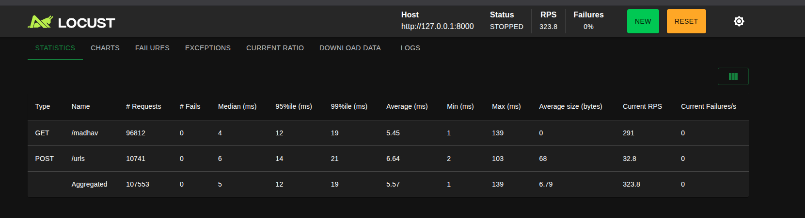

100 users 
ramp up 10 

0s → 10 users
1s → 20 users
2s → 30 users
...
10s → 100 users  once reached 100 it stays as it is

Concurrent users → load we're applying
Ramp-up          → how quickly we apply it
RPS              → how much traffic the system actually handles
Latency          → how quickly it responds
P95              → how slow the worst 5% of requests are
Failures         → reliability

9:1 ratio read:write
