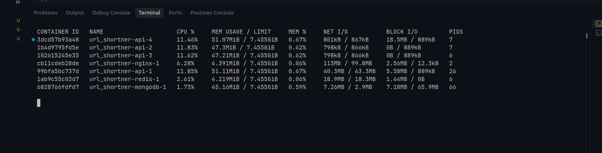
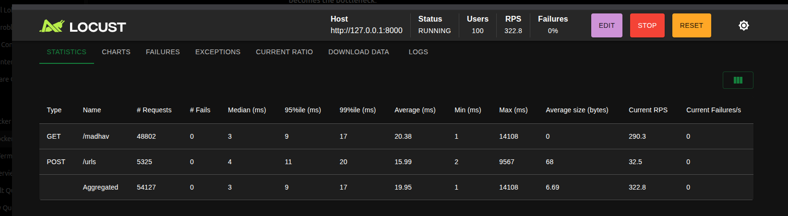
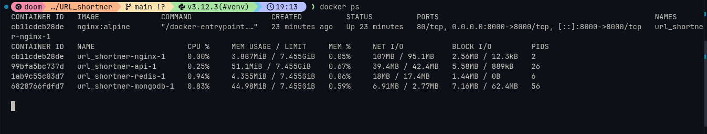
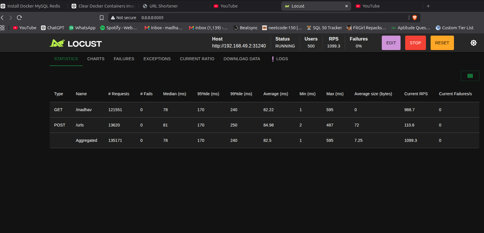
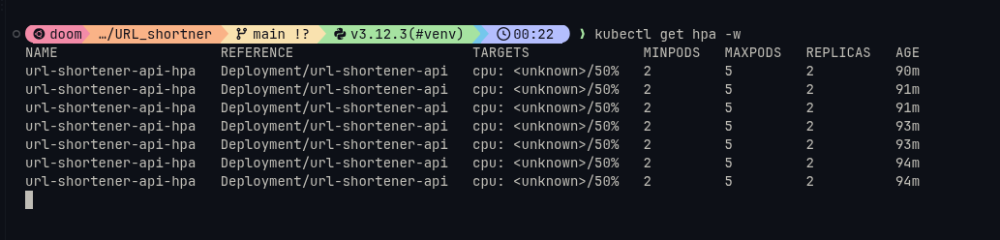
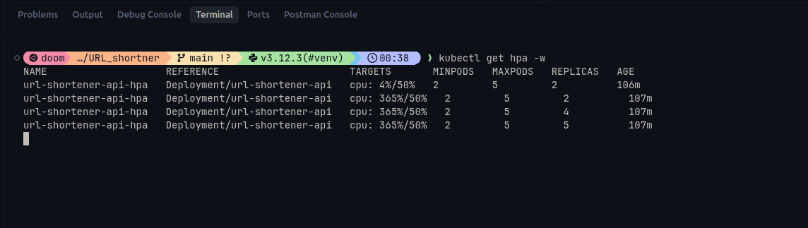
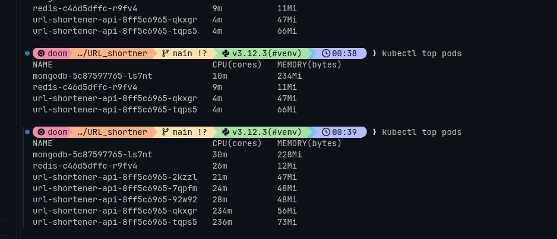
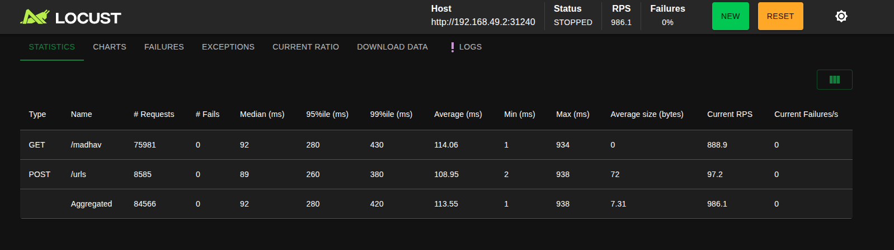

100 users 
ramp up 10 

0s → 10 users
1s → 20 users
2s → 30 users
...
10s → 100 users  once reached 100 it stays as it is

Concurrent users → load we're applying
Ramp-up          → how quickly we apply it
RPS              → how much traffic the system actually handles
Latency          → how quickly it responds
P95              → how slow the worst 5% of requests are
Failures         → reliability

9:1 ratio read:write

4 instances - 323 RPS

4 instance docker stats

1 instances - 322 RPS

1 instance docker stats

We didn't find an obvious bottleneck because:

API CPU      ~11–12%
Nginx CPU    ~6%
Redis CPU    ~2.6%
Mongo CPU    ~1.7%

So your current machine wasn't anywhere near CPU saturation.

NOW kubernitics

auto scaled 

scale down later
